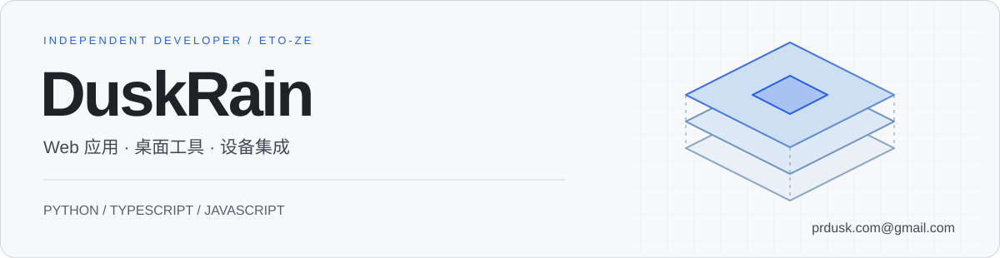

  <picture><source media="(prefers-color-scheme: dark)" srcset="./assets/banner.svg" /></picture>

独立开发者，主要使用 **Python、TypeScript 和 JavaScript**。开发 Web 应用、桌面工具与设备配套软件，负责功能实现、服务部署和版本维护。

**[个人技术主页 ↗](https://eto-ze.github.io/)** · [邮件联系](mailto:prdusk.com@gmail.com)

## 技术栈

### 前端与交互

<picture><source media="(prefers-color-scheme: dark)" srcset="./assets/frontend-dark.svg" /></picture>

**TypeScript · JavaScript · Vue · React · Vite · Three.js** 
构建业务界面、管理后台与浏览器 3D 场景，通过 WebSocket 实现多人状态同步。

### 后端与自动化

<picture><source media="(prefers-color-scheme: dark)" srcset="./assets/backend-dark.svg" /></picture>

**Python · FastAPI · Node.js · SQLite** 
实现 API、账户权限与数据存储，处理数据采集、批量任务和本地工作流。

### 硬件与设备

**MicroPython · ESP32 · RP2040 · LVGL** 
开发设备配套软件与屏幕界面，完成设备通信、状态显示和软硬件联调。

### 工程与部署

<picture><source media="(prefers-color-scheme: dark)" srcset="./assets/workflow-dark.svg" /></picture>

**Git · Docker Compose · PowerShell** 
管理代码版本、服务配置和部署流程，通过脚本处理日常维护与重复操作。

## 联系方式

软件开发、设备集成与项目交流：[prdusk.com@gmail.com](mailto:prdusk.com@gmail.com)

---

GitHub 公开活动与语言分布

  <a href="https://github.com/ETO-ze"><picture><source media="(prefers-color-scheme: dark)" srcset="https://github-readme-stats-fast.vercel.app/api?username=ETO-ze&amp;show_icons=true&amp;hide_border=true&amp;bg_color=101923&amp;title_color=89B4E8&amp;text_color=B8C4D4&amp;icon_color=89B4E8&amp;hide_rank=true" /><source media="(prefers-color-scheme: light)" srcset="https://github-readme-stats-fast.vercel.app/api?username=ETO-ze&amp;show_icons=true&amp;hide_border=true&amp;bg_color=F6F8FA&amp;title_color=0969DA&amp;text_color=424A53&amp;icon_color=0969DA&amp;hide_rank=true" /></picture></a>
  <a href="https://github.com/ETO-ze?tab=repositories"><picture><source media="(prefers-color-scheme: dark)" srcset="https://github-readme-stats-fast.vercel.app/api/top-langs/?username=ETO-ze&amp;layout=compact&amp;hide_border=true&amp;bg_color=101923&amp;title_color=89B4E8&amp;text_color=B8C4D4&amp;langs_count=6" /><source media="(prefers-color-scheme: light)" srcset="https://github-readme-stats-fast.vercel.app/api/top-langs/?username=ETO-ze&amp;layout=compact&amp;hide_border=true&amp;bg_color=F6F8FA&amp;title_color=0969DA&amp;text_color=424A53&amp;langs_count=6" /></picture></a>

统计卡片由第三方服务动态生成，可能存在缓存延迟；语言分布按公开仓库代码量统计。

