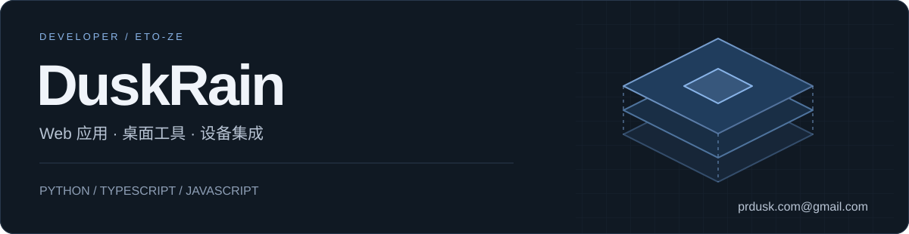
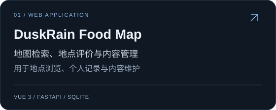
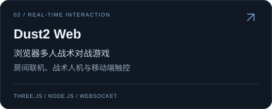
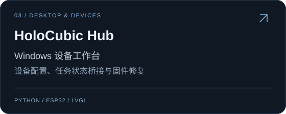
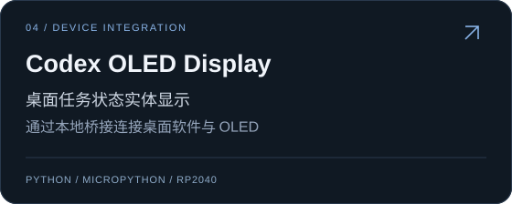

  

独立开发者，主要使用 Python、TypeScript 和 JavaScript，开发 Web 应用、桌面工具与设备配套软件，负责功能开发、服务部署和版本维护。

[GitHub](https://github.com/ETO-ze) · [邮件联系](mailto:prdusk.com@gmail.com)

## 技术栈

**前端与交互**

构建业务界面、管理后台与浏览器 3D 场景；通过 WebSocket 实现多人状态同步。

**后端与自动化**

实现 API、账户权限与数据存储，处理数据采集、批量任务和本地工作流。

**设备与部署**

使用 MicroPython、ESP32、RP2040 与 LVGL 完成设备通信和状态显示；使用 Git、Docker Compose 管理版本与部署。

## 代表项目

<table>
  <tr>
    <td width="50%"></td>
    <td width="50%"></td>
  </tr>
  <tr>
    <td width="50%"></td>
    <td width="50%"></td>
  </tr>
  <tr>
    <td colspan="2"></td>
  </tr>
</table>

## GitHub 统计

  
  

统计卡片由第三方服务动态生成，可能存在缓存延迟；语言分布按公开仓库代码量统计。

## 联系方式

软件开发、设备集成与项目合作：[prdusk.com@gmail.com](mailto:prdusk.com@gmail.com)
